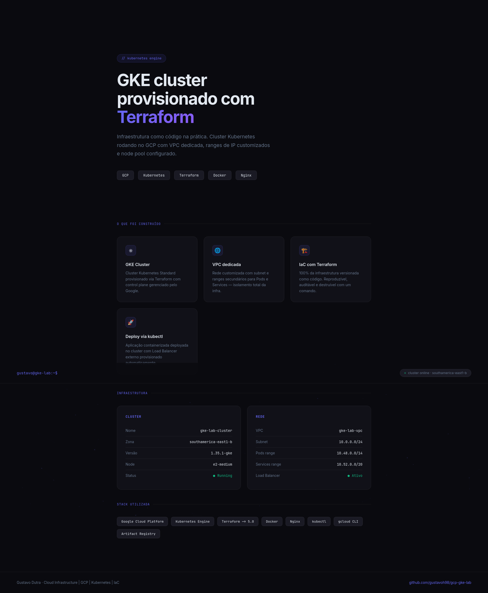

# Projeto (GCP) - GKE Lab

## O que esse lab faz:
Provisionamento de um cluster GKE na GCP utilizando Terraform, com VPC dedicada, subnet customizada com ranges secundários para Pods e Services, e node pool configurado.

## Arquitetura:
- VPC customizada com auto_create_subnetworks desativado
- Subnet com range principal para Nodes e ranges secundários para Pods e Services
- Cluster GKE com node pool separado
- 1 Node e2-medium
  


## Pré-requisitos:
- Terraform >= 1.5
- GCP Project com billing ativo
- gcloud CLI autenticado

## Como usar
```bash
terraform init
terraform plan
terraform apply
```

## Recursos criados
- google_compute_network
- google_compute_subnetwork
- google_container_cluster
- google_container_node_pool
## Site deployado no cluster

Site estático servido via Nginx rodando como Pod no GKE, exposto com LoadBalancer externo.

- Imagem base: `nginx:alpine`
- Deploy via `kubectl` + ConfigMap
- IP externo provisionado automaticamente pelo GKE


